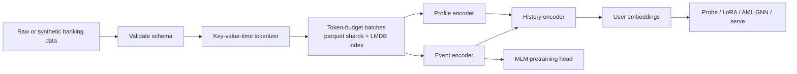

# pragmatiq

<p align="center">
  
</p>

<p align="center">
  <a href="https://pypi.org/project/pragmatiq/"></a>
  <a href="https://pragmatiq.getdynamiq.ai"></a>
  <a href="https://github.com/dynamiq-ai/pragmatiq/actions/workflows/ci.yml"></a>
  <a href="https://github.com/dynamiq-ai/pragmatiq/blob/main/LICENSE"></a>
  
  
</p>

**pragmatiq** is a developer-friendly implementation of ideas described in the
PRAGMA paper ([arXiv:2604.08649](https://arxiv.org/abs/2604.08649)) by
Ostroukhov et al. It turns user histories made of timestamped key-value events
into embeddings that downstream teams can use for probes, LoRA fine-tuning,
graph-based AML experiments, explainability, and serving.

The repository includes the full stack: a deterministic synthetic banking data
generator, tokenizer, padding-free PyTorch model, training pipeline, batch
embedding, ONNX/Triton serving, notebooks, and a Streamlit demo. It is built to
run on CPU first; CUDA and flash-attn are accelerations, not requirements.

> pragmatiq is an independent implementation inspired by the PRAGMA paper
> (arXiv [2604.08649](https://arxiv.org/abs/2604.08649)).
> It is not affiliated with or endorsed by Revolut.

## Contents

- [Why this exists](#why-this-exists)
- [Quickstart](#quickstart)
- [What is included](#what-is-included)
- [Architecture](#architecture)
- [Repository map](#repository-map)
- [Workflows](#workflows)
- [Using your own data](#using-your-own-data)
- [Training on GPU](#training-on-gpu)
- [Extending pragmatiq](#extending-pragmatiq)
- [AML over the transfer graph](#aml-over-the-transfer-graph)
- [Model sizes](#model-sizes)
- [PRAGMA+Nemotron text-embedding variant](#pragmanemotron-text-embedding-variant)
- [Defaults where the paper is silent](#defaults-where-the-paper-is-silent)
- [Serving with Triton](#serving-with-triton)
- [Streamlit demo](#streamlit-demo)
- [Observability](#observability)
- [Notebooks](#notebooks)
- [Development](#development)
- [Citation](#citation)
- [License](#license)

## Why this exists

The PRAGMA paper ([arXiv:2604.08649](https://arxiv.org/abs/2604.08649))
describes a practical foundation-model recipe for heterogeneous banking
behavior: transactions, app sessions, trades, communications, profiles, and
transfer relationships. The paper does not ship reference code.

pragmatiq provides an open implementation that researchers, ML engineers, and
data scientists can run, inspect, adapt, and benchmark. The goal is not to claim
novelty over PRAGMA. The goal is to make the implementation path concrete.

## Quickstart

```bash
# pragmatiq is in public beta on PyPI (a pre-release, so --pre is required):
pip install --pre pragmatiq
pragmatiq quickstart
```

Or from a clone of the repo (for development):

```bash
git clone https://github.com/dynamiq-ai/pragmatiq.git && cd pragmatiq
pip install -e ".[dev]"
```

`quickstart` runs a CPU-capable synthetic pipeline end to end:

1. generate synthetic users and event histories,
2. fit the key-value-time tokenizer,
3. pretrain a small masked-language model,
4. embed users,
5. run a gradient-boosting credit-risk probe against a raw-count baseline.

For a smaller local smoke test:

```bash
pragmatiq quickstart --n-users 2000 --max-steps 80
```

For development from a source checkout:

```bash
pip install -e ".[dev]"
```

Optional extras are available for focused workflows: install `.[gnn]` for AML
graph experiments, `.[demo]` for Streamlit, `.[serve]` for export/serving,
`.[tb]` for TensorBoard, and `.[wandb]` for experiment tracking.

The same workflow is available from Python:

```python
from pragmatiq import api

result = api.quickstart(n_users=2000, max_steps=80)
print(result["message"])
```

The CLI is intentionally thin. Commands parse arguments, then call public
functions in [`pragmatiq/api.py`](pragmatiq/api.py), so notebook and production
callers use the same library surface.

## What is included

| Area | What pragmatiq ships |
| --- | --- |
| Synthetic data | Agent-based banking simulator with deterministic seeds, causal labels, fraud/default/AML scenarios, and realism checks. |
| Tokenization | Key-value-time tokenizer for numeric bins, categorical values, descriptor text, profiles, and unseen `[UNK]` fallbacks. |
| Model | PRAGMA-style profile, event, and history encoders with TimeRoPE, padding-free varlen attention, and tied MLM head. |
| Training | CPU-safe pretraining, resume-safe checkpoints, probes, LoRA fine-tuning, and configurable heads/maskers/value encoders. |
| AML graph | GraphSAGE ablation over transfer graphs using isolated embeddings, pragmatiq features, and hand-crafted graph features. |
| Inference | Batch embedding, `PragmaModel.from_pretrained(run)`, notebook-friendly `embed_records`, integrated-gradients attribution, ONNX, and Triton serving. |
| Publication assets | Model card, contribution guide, citation metadata, security policy, Apache-2.0 license, and GitHub templates. |

## Architecture



At a high level, pragmatiq follows the PRAGMA recipe:

- Key and value embeddings share one table, also reused for tied MLM logits.
- Continuous time positions use the paper's `8 * ln(1 + delta_t / 8)` transform.
- Events are encoded independently, then combined with profile information in a
  bidirectional history encoder.
- Masking combines token, whole-event, and key-level masks; `[UNK]` replacements
  are excluded from MLM loss.
- Checkpoints include model, optimizer, scheduler, sampler position, RNG states,
  tokenizer hash, and resolved config.
- Registries let users customize heads, maskers, and value encoders without
  forking the library.

See [`docs/architecture.md`](docs/architecture.md) for a teaching-grade walkthrough of
the encoders, temporal encoding, and objective, and [`MODEL_CARD.md`](MODEL_CARD.md) for the
objective and limitations write-up.

### Paper fidelity

What follows the PRAGMA paper, and what pragmatiq adds on top:

| Component | In the paper | pragmatiq |
| --- | --- | --- |
| Key–value–time tokenization, `8·ln(1+Δt/8)` time transform, TimeRoPE on continuous log-seconds | ✓ | faithful |
| Profile / event / history encoders; 3d MLM head `[ẑ_e, z_h(EVT), z_h(USR)]` → tied logits + label smoothing | ✓ | faithful |
| Masking 15% token / 10% event / 10% key, 10% `[UNK]`-as-dropout excluded from loss | ✓ | faithful |
| Model sizes 10M / 100M / 1B | ✓ | faithful S/M/L (+ a CPU `nano` for CI) |
| Pre-training caps (event ≤24 tokens, profile ≤200, ≤6500 events/user) | ✓ | faithful |
| PRAGMA+Nemotron frozen-text-embedding variant (MSE reconstruction) | ✓ | implemented, switchable, **off by default** |
| Synthetic data generator | the paper uses real Revolut data | **our addition** — agent-based, deterministic |
| AML over the transfer graph (GraphSAGE ablation) | not in the paper | **our addition**, presented standalone |
| Downstream probe | LoRA + a probe across tasks | gradient boosting is **our default** probe head |

## Repository map

```
pragmatiq/
├── pragmatiq/               # the library — all logic lives here
│   ├── api.py               # public functions: synthesize / tokenize / pretrain / ...
│   ├── cli.py               # Typer CLI (parses args, calls api.py, nothing else)
│   ├── registry.py          # @register_head / @register_masker / @register_value_encoder
│   ├── validate.py          # data-contract validation with actionable errors
│   ├── data/                # schema, tokenizer, sharding, collation, synthetic generator
│   ├── models/              # encoders, MLM head, LoRA, AML GNN (gnn.py)
│   ├── training/            # pretrainer, masking, Muon+AdamW, probe, finetuner
│   ├── inference/           # batch embedder, attribution (explain.py), ONNX export, benchmarks
│   └── experiments/         # run directories, metric logging, run comparison
├── configs/                 # model / pretrain / tokenizer / synthetic / finetune YAMLs
├── notebooks/               # 01–04 guided walkthroughs (see Notebooks below)
├── demo/app.py              # Streamlit demo
├── deploy/                  # Triton model repo, docker-compose, Prometheus, demo Dockerfile
├── scripts/                 # runpod_launch.py (GPU rental), gates/ (maintainer validation)
└── tests/                   # the spec in executable form — useful usage examples
```

The [`tests/`](tests/) directory doubles as living documentation: for example
[`tests/test_tokenizer.py`](tests/test_tokenizer.py) shows the tokenizer
contract end to end, and [`tests/test_training.py`](tests/test_training.py)
demonstrates bit-exact checkpoint resume.

## Workflows

The quickstart is the best first run. Use the commands below when you want to
drive each stage explicitly.

### 1. Generate and tokenize data

```bash
pragmatiq synth generate --out data/synth --config configs/data/synthetic.yaml
pragmatiq tokenize data/synth --out data/tokenized --n-workers 8
```

The generator takes `--n-users`, `--seed`, and `--n-workers`; the same seed
produces byte-identical output for any worker count. To fit generator priors to
aggregate statistics a bank can share (no raw data), use
`pragmatiq synth calibrate --stats configs/data/aggregates.example.yaml`.

### 2. Pretrain and embed

```bash
pragmatiq pretrain data/tokenized --name demo --model-size small --config configs/pretrain.yaml
pragmatiq embed data/tokenized --run runs/demo --out embeddings.parquet
```

Inspect and compare runs at any point:

```bash
pragmatiq runs list
pragmatiq runs compare demo other-run
```

### 3. Evaluate task signal

`probe` is the fastest CPU check. Use fine-tuning when you want supervised
adapter training on a labeled task.

```bash
pragmatiq probe data/tokenized --run runs/demo --label data/synth/labels/default_12m.parquet
pragmatiq finetune data/tokenized --run runs/demo --label data/synth/labels/default_12m.parquet \
  --config configs/finetune/credit.yaml
```

The probe head is **gradient boosting** by default (`HistGradientBoostingClassifier`;
`--probe-model logistic` or `lightgbm` switch it), which captures the non-linear
structure of a learned embedding better than a linear head. Both ROC-AUC and PR-AUC
are reported — PR-AUC is the honest headline on the low-prevalence risk tasks — and
the **raw-count baseline uses the same classifier**, so the gap reflects the
representation, not the model family. On the default synthetic book the pragmatiq
probe beats that baseline. When a label table carries an `eval_ts` column, histories
are truncated at it before embedding — for both the probe and the baseline — so
metrics are forecasts, never hindcasts.

The embedding's value is not specific to credit. The multi-task probe benchmark
(`scripts/benchmarks/multitask_probe.py`) probes every user-level task against
the same raw-count baseline. The table below is auto-written by
`write_multitask_report` on an opt-in run (`PRAGMATIQ_WRITE_RESULTS=1`), carries
a provenance stamp, and is refused if it would replace a larger-scale result.
Event-level `fraud`/`recurring` (transaction/series-level) and `comm_uplift`
(a treatment-effect task — see `pragmatiq uplift`) are evaluated by their own
paths, not this user-embedding probe.

<!-- MULTITASK_PROBE_RESULTS -->

| task | probe AUC | raw-count baseline | probe - baseline | prevalence |
| --- | --- | --- | --- | --- |
| default_12m | 0.770 | 0.543 | +0.228 | 0.03 |
| churn_6m | 0.744 | 0.609 | +0.135 | 0.12 |
| ltv_positive | 0.828 | 0.667 | +0.161 | 0.80 |

<sub>provenance: n_users=50000, model=small, steps=2000, seed=0, commit=7353776</sub>

## Using your own data

pragmatiq trains on a small parquet contract — four files, strict dtypes
(enforced by `pragmatiq validate`, defined in
[`pragmatiq/data/schema.py`](pragmatiq/data/schema.py)):

| File | Required columns |
| --- | --- |
| `events.parquet` | `user_id` (string), `ts` (timestamp[us]), `source` (string), `fields` (map<string,string>) |
| `profiles.parquet` | `user_id` (string), `as_of` (timestamp[us]), `attributes` (map<string,string>), `lifelong` (list<struct<key: string, ts: timestamp[us]>>) |
| `transfers.parquet` | optional, for the AML GNN; `from_user`, `to_user` (string), `ts` (timestamp[us]), `amount` (float64) |
| `labels/*.parquet` | optional task tables: `user_id` (string), `eval_ts` (timestamp[us]), `label` (int8) |

The subsections below walk through producing each file from a typical bank
data warehouse.

### Events: one row per event, fields as a string map

Every event is `(user_id, ts, source, fields)`. `source` must be one of
`transaction`, `app`, `trading`, `communication`. `fields` is a flat
`map<string,string>`: stringify everything — the tokenizer decides per key
whether a field is numeric (percentile-binned into 64 buckets + a zero
bucket), categorical (one token per value up to 1000 distinct values), or
free text (byte-level BPE). A flattening export looks like this
(Trino/Spark-flavored SQL):

```sql
-- one row per event, sorted so each user's rows are adjacent and time-ordered
CREATE TABLE export.events AS
SELECT * FROM (
    SELECT CAST(t.customer_id AS VARCHAR)        AS user_id,
           t.booked_at                           AS ts,
           'transaction'                         AS source,
           MAP(ARRAY['amount', 'currency', 'mcc', 'merchant', 'channel'],
               ARRAY[CAST(t.amount AS VARCHAR), t.currency,
                     CAST(t.mcc AS VARCHAR), t.merchant_name, t.channel]) AS fields
    FROM dwh.card_transactions t

    UNION ALL

    SELECT CAST(a.customer_id AS VARCHAR),
           a.event_time,
           'app',
           MAP(ARRAY['screen', 'action', 'os'],
               ARRAY[a.screen, a.action, a.os])
    FROM dwh.app_events a
)
ORDER BY user_id, ts;
```

The `ORDER BY (user_id, ts)` is not cosmetic: `pragmatiq validate` errors on
out-of-time-order events within a user and warns when one user's rows appear in
non-adjacent blocks (they would tokenize as multiple records). Different
sources can carry completely different field keys — that heterogeneity is the
point of the key-value scheme.

### Profiles: static attributes plus lifelong milestones

One row per user: `attributes` holds static key-values (country, age band,
plan), `lifelong` holds dated milestones (account opened, KYC passed, first
card), and `as_of` is the snapshot timestamp:

```sql
CREATE TABLE export.profiles AS
SELECT CAST(c.customer_id AS VARCHAR)                      AS user_id,
       CURRENT_TIMESTAMP                                   AS as_of,
       MAP(ARRAY['country', 'age_band', 'plan'],
           ARRAY[c.country, c.age_band, c.plan])           AS attributes,
       ARRAY[ROW('account_opened', c.opened_at),
             ROW('kyc_passed',     c.kyc_at)]              AS lifelong
FROM dwh.customers c;
```

### Transfers and labels

`transfers.parquet` is the directed money-flow edge list consumed by the
[AML GNN](#aml-over-the-transfer-graph) — only needed for graph experiments.

Label tables are `(user_id, eval_ts, label)`:

```sql
CREATE TABLE export.labels_default_12m AS
SELECT CAST(customer_id AS VARCHAR)            AS user_id,
       observation_date                        AS eval_ts,  -- when the decision was made
       CAST(defaulted_within_12m AS TINYINT)   AS label
FROM risk.default_outcomes;
```

**Why `eval_ts` matters.** `pragmatiq probe` truncates each user's history at
their `eval_ts` before embedding, so the embedding only sees what the bank knew
at decision time and the reported AUC is a genuine forecast, not a hindcast on
data that already contains the outcome. The AML task is the deliberate
exception: mule detection is membership classification over observed activity,
so it uses the full horizon (see [`MODEL_CARD.md`](MODEL_CARD.md)).

### Validate, tokenize, pretrain

```bash
pragmatiq validate data/mybank
pragmatiq tokenize data/mybank --out data/mybank-tokenized --n-workers 8
pragmatiq pretrain data/mybank-tokenized --name mybank-v1 --model-size small
```

`validate` catches dtype mismatches, null ids, null timestamps, unknown sources,
timestamp ordering problems, non-contiguous user rows, and cardinality
pathologies — each finding is a human-readable string with a concrete fix, and
the command exits nonzero on errors. Events must be grouped by user and ascending
in `ts`; sort by `(user_id, ts)` before tokenizing (a user whose rows are split
apart is refused rather than silently fragmented). `tokenize --n-workers N`
parallelizes encoding across processes with a byte-identical guarantee: shard
files are identical for any worker count.

To rehearse this path against sparse data before pointing it at a real feed,
generate synthetic data with `missing_field_rate > 0` (a `WorldConfig` knob): that
fraction of event fields is dropped deterministically, so you can confirm the
validate → tokenize → train flow tolerates missing fields.

### Time zones and the calendar features

pragmatiq derives the hour-of-day, day-of-week and day-of-month calendar features
from each event's timestamp, and by default treats timestamps as **UTC**. If your
data is in a local zone — so the behavioural day/night, weekend and payday
structure is local — set `calendar_tz` in the tokenizer config to an IANA zone:

```yaml
# tokenizer.yaml passed via `pragmatiq tokenize --config`
calendar_tz: Europe/London   # default: UTC
```

or programmatically, `api.tokenize(raw, out, config={"calendar_tz": "Europe/London"})`.
Pass timezone-aware timestamps so the instant itself is correct; only the
wall-clock calendar features are localized (DST included). `calendar_tz` is folded
into the tokenizer content hash, so a checkpoint refuses to load against a
tokenizer fitted with a different zone.

### `[UNK]` and when to refit the tokenizer

At inference time, keys and values not seen during tokenizer fitting map to
`[UNK]` with a logged warning instead of raising `KeyError`. That makes drift
visible instead of fatal — but a rising `[UNK]` rate is a signal, not a
feature.

- **Reuse a tokenizer** (`pragmatiq tokenize newdata --tokenizer-dir
  data/mybank-tokenized/tokenizer ...`) whenever you tokenize new data for an
  **existing trained model**. This is mandatory, not just convenient:
  checkpoints embed the tokenizer content hash and
  `PragmaModel.from_pretrained()` refuses to load against a mismatched
  tokenizer.
- **Refit a tokenizer** (the default, no `--tokenizer-dir`) when you are
  starting a **new pretraining run** — new bank, new event sources, or enough
  drift that `[UNK]` warnings are frequent. A refit changes the vocabulary, so
  it always implies pretraining a new model with it.

## Training on GPU

Everything runs on CPU (slow but correct); a GPU is an acceleration, not a
requirement. The trainer is built on Lightning Fabric and auto-detects CUDA:
on GPU it trains in **bf16-mixed** precision, on CPU in fp32 — no flags
needed, `pragmatiq pretrain` is the same command on both.

**flash-attn is optional.** When `flash-attn` is installed on CUDA, varlen
attention uses `flash_attn_varlen_func` directly on the packed, padding-free
token stream. Otherwise pragmatiq falls back to PyTorch SDPA over per-segment
padded blocks built from `cu_seqlens` — the two paths agree to fp32 atol 1e-4
(checked in CI as the padding-equivalence test).

### Knobs that matter

All defaults live in [`configs/pretrain.yaml`](configs/pretrain.yaml) and map
1:1 onto `TrainConfig` in
[`pragmatiq/training/pretrainer.py`](pragmatiq/training/pretrainer.py); any
key can be overridden via `--config` or programmatically through
`api.pretrain(..., key=value)`.

| Knob | Default | What it does |
| --- | --- | --- |
| `max_steps` | `20000` | Optimizer steps; also the cosine-schedule horizon. |
| `token_budget` | `16384` | Tokens per packed forward (the per-device memory knob — raise it on big GPUs). |
| `grad_accum_steps` | `1` | Micro-batches per optimizer step. Effective batch = `token_budget × grad_accum × world_size`; raise it for a large, stable batch on a memory-bound GPU without raising `token_budget`. |
| `devices` / `num_nodes` | `auto` / `1` | Fabric DDP: per-node device count and host count (multi-node). |
| `lr_muon` / `lr_adamw` | `3e-3` / `3e-4` | Muon drives 2-D hidden weights; AdamW drives embeddings/norms/biases. |
| `warmup_steps` | `500` | Linear warmup before the cosine decay. |
| `weight_decay` / `grad_clip` | `0.01` / `1.0` | Applied to both optimizers. |
| `checkpoint_every_min` | `15.0` | Wall-clock minutes between full checkpoints. |
| `log_every` | `20` | Steps between metric logs and the stderr heartbeat. |
| `verbose` | `true` | One-line heartbeat (`step, loss, mlm_acc, tok/s, ETA`); `--quiet` disables it. |
| `wandb` / `wandb_project` | `false` / `pragmatiq` | Weights & Biases mirror (or pass `--wandb`). |
| `seed` / `nan_skip` | `0` / `true` | Reproducibility; NaN/inf losses dump the batch to `debug/` and skip the step. |
| `max_consecutive_skips` | `50` | Abort if this many steps in a row are skipped for a non-finite loss/grad — a divergence guard so a broken run fails loud instead of burning compute. |
| `deterministic` | `false` | Opt-in reproducible CUDA path (see [Determinism](#determinism)); forces fp32 on GPU, at a throughput cost. |
| `masker`, `p_token`, `p_event`, `p_key`, `p_unk` | `pragma`, `0.15`, `0.10`, `0.10`, `0.10` | Masking strategy (swappable via `@register_masker`) and its rates. |
| `text_loss_weight` | `1.0` | Weight λ on the text MSE term in the [Nemotron variant](#pragmanemotron-text-embedding-variant) (`loss = CE + λ·MSE`); inert without a text encoder. |

### Scaling to 1M–26M records, hands-off

Pointing pragmatiq at a large book should not require tuning the batch or schedule.
Pass `config="auto"` (or `--config auto`) and it sizes `token_budget`, `grad_accum_steps`,
`max_steps`, and `warmup_steps` from the shard index (user count, token distribution) and
the target device, with an explainable rationale logged at startup:

```bash
pragmatiq pretrain data/tokenized --name big --model-size medium --config auto
```

```python
api.pretrain("data/tokenized", "big", model_size="medium", config="auto")
```

Explicit overrides still win (`api.pretrain(..., config="auto", grad_accum_steps=8)`), and
[`autoconfigure`](pragmatiq/training/autoconfig.py) is callable directly to inspect the plan.
The three levers it sets are also usable by hand:

- **Gradient accumulation** decouples the effective batch from device memory. `grad_accum_steps`
  micro-batches accumulate before one clip + optimizer step, so a stable batch is reached on a
  memory-bound GPU without raising `token_budget`. With the default `1` the trajectory is
  byte-identical to no accumulation.
- **Multi-node DDP** is `devices` (per-node) × `num_nodes`. The rank sampler shards the data per
  global rank with a per-rank masking seed, so adding ranks trains disjoint slices in lockstep.
- **Truncation caps** (set on the tokenizer: `max_event_tokens=24`, `max_profile_tokens=200`,
  `max_events_per_user=6500`) keep heavy-tailed real histories tractable; they do not bind at
  synthetic scale, so default output is unchanged.

### Resume semantics

```bash
pragmatiq pretrain data/tokenized --name demo --resume auto
```

`--resume auto` picks up `runs/demo/checkpoints/last.pt` if it exists.
Checkpoints capture the model, **both** optimizers, the LR scheduler, the
sampler position, all RNG states (torch, numpy, CUDA, and the masking
generator), the tokenizer hash, and the resolved config — so an interrupted
run resumed mid-flight reproduces the exact batch and masking stream of an
uninterrupted one (this is tested bit-exactly). Resuming with a different
tokenizer is refused with a clear error.

### Determinism

From a fixed seed, **CPU runs are byte-identical** — weight init, dropout, the
masking stream, and shard/worker output are all seeded (CI-enforced for the
generator and the resume test). GPU kernels use a different reduction order, so
**CPU and GPU outputs are never bit-identical to each other** — pick one target
and compare against itself.

The opt-in `deterministic: true` flag makes the **GPU** path reproducible on
fixed hardware. It enables `torch.use_deterministic_algorithms`, the cuDNN
deterministic path, flash-attn's deterministic backward, and (because bf16
backward on CUDA has no deterministic implementation upstream) trains in fp32
instead of bf16-mixed. With it on:

- **GPU forward / embedding** is reproducible run-to-run on the same hardware.
- **GPU training is bit-exact in fp32** (same seed → same loss curve).
- **GPU bf16 training is *not* bit-exact** — the SDPA/flash bf16 backward stays
  nondeterministic upstream. Leaving `deterministic: false` keeps the default
  bf16-mixed path; a deterministic bf16 run is run-to-run stable to ~1e-3.

The flag is **off by default**, so default performance and behaviour are
unchanged; turn it on only when you need a reproducible GPU run and can accept
the fp32 throughput cost.

### Multi-GPU and renting a GPU

Fabric launches DDP across all visible CUDA devices automatically — no flag
changes, just run on a multi-GPU host. Each rank trains a disjoint, equal-sized
shard of every epoch's batches (so the gradient all-reduce covers the full epoch
once) with an independent masking stream, and only rank 0 writes checkpoints and
metrics. For **multi-node** jobs set `num_nodes` (and `devices` per node) in the
config; the rank sharding and per-rank masking extend across the whole world. Pair
this with `grad_accum_steps` and `config: auto` (see
[Scaling to 1M–26M records](#scaling-to-1m26m-records-hands-off)) for a large, stable
effective batch without per-device OOM.

As a reference point: the `small` model sustains roughly **79k tokens/s on a
single A100** at `token_budget: 8192` (full-scale gate-5 run; throughput is
logged per run in `runs/<name>/metrics.jsonl`, so measure on your own data).

[`scripts/runpod_launch.py`](scripts/runpod_launch.py) is a turnkey path for
validating on a rented A100/H100: it creates a RunPod pod via the REST API,
syncs the repo over SSH (no GitHub required), installs, and runs the GPU
end-to-end pipeline:

```bash
export RUNPOD_API_KEY=...
python scripts/runpod_launch.py --gpu "NVIDIA A100 80GB PCIe" --run-name a100-smoke
python scripts/runpod_launch.py --terminate <pod_id>
```

## Extending pragmatiq

Heads, maskers, and value encoders are resolved by name through
[`pragmatiq/registry.py`](pragmatiq/registry.py), so you can plug in your own
without forking. Register a component with the matching decorator and reference it
by name in a config.

```python
import torch.nn as nn
from pragmatiq.registry import register_head

@register_head("ranking")
class RankingHead(nn.Module):
    """A custom task head on the user embedding z_h[USR] -> [n_users, n_classes]."""

    def __init__(self, dim: int, n_classes: int = 2) -> None:
        super().__init__()
        self.net = nn.Sequential(nn.Linear(dim, dim), nn.GELU(), nn.Linear(dim, n_classes))

    def forward(self, user_repr):
        return self.net(user_repr)
```

Select it in a fine-tune config and run as usual:

```yaml
# myhead.yaml
head: ranking
n_classes: 2
lora_rank: 8
```

```bash
pragmatiq finetune data/tokenized --run runs/mybank-v1 \
  --label data/mybank/labels/churn.parquet --config myhead.yaml
```

Registration is an import side effect, so import the module that defines your
component before `finetune`/`get_head` runs (keep it in a package your config or
entry point imports). `@register_masker(name)` and `@register_value_encoder(name)`
work the same way, referenced by the `masker` and `value_encoder` config keys.

## AML over the transfer graph

Money laundering through mule rings is a **relational** problem: a mule is
defined by who they transact with (fan-in of small credits, layering inside
the ring, shared cash-out), not only by their own behavior. pragmatiq ships a
transfer-graph extension that tests exactly how much of that signal a graph
recovers. It needs the `gnn` extra (`pip install "pragmatiq[gnn]"` for
torch-geometric).

### The pieces

- **`TransferGraphBuilder`**
  ([`pragmatiq/models/gnn.py`](pragmatiq/models/gnn.py)) turns
  `transfers.parquet` plus frozen pragmatiq user embeddings into a PyG graph:
  nodes are embedded users, directed edges are money flows (kept only between
  users that have features), edge attributes are amount and log-recency, node
  features are the embeddings, and node labels mark mules.
- **`AmlGNN`** is a 2–3 layer GraphSAGE node classifier with two deliberate
  design choices. **Sum aggregation**: mule detection hinges on fan-in, and
  mean aggregation normalizes degree away — sum keeps it, so message passing
  can recover the structural signal regardless of which node features are
  used. **A raw-feature skip to the head**: each node's own features are
  projected and concatenated with the graph representation before
  classification (with residual conv layers), because without it the stack
  over-smooths and loses the per-user signal an isolated probe already has.

### The four-arm ablation

`pragmatiq gnn` (and `api.gnn`) runs four setups on identical, stratified
train/val/test splits shared across arms, over multiple seeds:

| Arm | Features | Graph? | Question it answers |
| --- | --- | --- | --- |
| (a) | pragmatiq embeddings | no — logistic probe | How far does a per-user embedding get alone? |
| (b) | pragmatiq embeddings | GraphSAGE | Does the transfer graph add to rich learned features? |
| (c) | hand-crafted node stats (degree, volume) | GraphSAGE | What does a fraud analyst's baseline + a graph achieve? |
| (d) | same hand-crafted stats | no — logistic control | Is the graph effect real, or just the features? |

**Relational recovery** is the headline claim, and on the default synthetic data
it holds: the graph-aware setup beats the isolated probe — `(c) > (a)` by a wide
margin — so AML signal genuinely lives in the transfer structure that an isolated
per-user embedding cannot see. Money mules are modeled as *ordinary recruited
accounts* (no distinctive individual behavior), and the laundering legs are
written to the transfer ledger (`transfers.parquet`), **not** the card-event
stream — so an embedding built from events scores at chance (`(a) ≈ 0.5`) and
only a model that reads the transfer graph recovers the rings.

Two limitations are reported in the verdict alongside the headline claim:

- The recovered signal is largely transfer-graph **degree**, a 1-hop relational
  statistic. The `(d)` control (logistic regression on the same hand-crafted
  degree/volume features, *no* graph) matches `(c)`, so on these synthetic rings
  message passing adds little over the degree features themselves
  (`message_passing_adds = (c) > (d)` is False).
- pragmatiq's behavioral embeddings do **not** beat hand-crafted degree
  (`(b) < (c)`): the mules are behaviorally ordinary by design, so the embedding
  carries no isolated AML signal and the structural signal is best read off
  degree. A regime where *learned* features beat hand-crafted ones needs a
  **behaviorally-dominant** (multi-hop relational) laundering signal — the open
  hard case, discussed in [`MODEL_CARD.md`](MODEL_CARD.md) and
  [`notebooks/04_aml_gnn.ipynb`](notebooks/04_aml_gnn.ipynb).

### Running it

```bash
pip install -e ".[gnn]"
pragmatiq gnn data/tokenized --run runs/demo \
  --transfers data/synth/transfers.parquet \
  --aml-label data/synth/labels/aml.parquet \
  --seeds 0,1,2 --epochs 150
```

The command embeds users with the trained run, builds the graph, fits each
arm per seed, and prints per-arm mean ± std ROC-AUC plus a verdict dict.
[`notebooks/04_aml_gnn.ipynb`](notebooks/04_aml_gnn.ipynb) is the interactive
version of the same experiment.

### Latest results

The table below is **auto-written** by `write_aml_report` in
[`pragmatiq/models/gnn.py`](pragmatiq/models/gnn.py) on a passing full run
(opt-in via `PRAGMATIQ_WRITE_RESULTS=1`). Generated tables carry a provenance
stamp (node/edge/mule counts, seeds, epochs, git commit), and the writer
refuses to overwrite a larger-scale result with a smaller-scale one — a
CI-scale run can never masquerade as a full-scale result.

<!-- AML_ABLATION_RESULTS -->

| setup | ROC-AUC (mean ± std over seeds) |
| --- | --- |
| (a) probe on isolated pragmatiq embeddings | 0.501 ± 0.020 |
| (b) GraphSAGE over transfers + pragmatiq features | 0.573 ± 0.037 |
| (c) GraphSAGE + hand-crafted node features | 0.846 ± 0.006 |
| (d) control: logistic regression on the same hand-crafted features, no graph | 0.842 ± 0.009 |

**Relational recovery (gated): (c) > (a) = True** — a GraphSAGE over the transfer graph beats a probe on isolated pragmatiq embeddings. Message passing adds over the same features without a graph ((c) > (d)) = False. Reported, not gated: (b) > (a) = True; (b) > (c) = False — these synthetic mules are structurally distinctive, so hand-crafted degree is a strong baseline (see MODEL_CARD).

<sub>provenance: n_nodes=12000, n_edges=345810, n_mules=434, seeds=[0, 1, 2], epochs=150, commit=7353776</sub>

## Model sizes

| Size | d | Heads | Depths (profile / event / history) | Nominal | Actual params at ~28k vocab |
| --- | --- | --- | --- | --- | --- |
| `small` | 192 | 3 | 1 / 5 / 2 | 10M | ~9.1M |
| `medium` | 512 | 8 | 3 / 16 / 6 | 100M | ~94M |
| `large` | 1024 | 16 | 9 / 45 / 18 | 1B | ~940M |

These sizes are the presets in `ModelConfig.preset`
(`pragmatiq/models/pragmatiq.py`); `configs/model/{small,medium,large}.yaml`
document them. Any architecture field (e.g. `rope_base`, `dropout`) can be
overridden by passing it in the pretrain `config`. The test suite checks the
model and MLM head parameter counts against the nominal sizes.

## PRAGMA+Nemotron text-embedding variant

The paper describes a variant in which high-cardinality **text** fields (merchant
names, device ids, free-text memos) are not split into BPE pieces. Instead a *frozen*
text model maps each value's full string to a single vector, and the MLM objective
reconstructs that continuous vector with **MSE** rather than predicting sub-word ids.
On its text-heavy tasks the paper reports a meaningful credit lift at a modest latency
cost, so pragmatiq ships it as a switchable option — **off by default**, so the BPE
path is byte-identical to a build without it.

It is switchable from the data step alone. Tokenize in embed mode and `pretrain`
auto-builds the matching frozen encoder and MSE reconstruction head — no model flags:

```bash
pip install -e ".[nemotron]"   # adds transformers (the frozen embedder)
pragmatiq tokenize data/synth --out data/tokenized --config configs/data/tokenizer_nemotron.yaml
pragmatiq pretrain data/tokenized --name nemo --model-size medium   # text branch auto-wired
```

- **Encoders** are resolved by name from the registry (`@register_text_encoder`): the
  production `nemotron` embedder (frozen, mean-pooled, `no_grad`), and a deterministic,
  dependency-free `hash` stand-in so the whole path — embed-mode tokenization, the text
  input projection, the MSE branch, and masking that routes text to reconstruction — is
  exercised on CPU in CI without downloading a multi-GB model.
- **Objective**: masked text tokens are reconstructed by a `Linear(3d → text_dim)` head
  against the frozen vector; the loss is `CE + λ·MSE` (`text_loss_weight`, default 1.0).
  Ordinary tokens keep the cross-entropy MLM objective.
- **Serving** handles both variants — build the Triton image with
  `PRAGMATIQ_TRITON_EXTRAS=nemotron` (see [Serving with Triton](#serving-with-triton)).

## Defaults where the paper is silent

The paper leaves some engineering details unspecified. pragmatiq treats these
as defaults, exposes them in config, and marks source-level guesses with
`# GUESS`.

| Knob | Default | Where |
| --- | --- | --- |
| Muon LR for 2-D hidden weights | `3e-3` | `configs/pretrain.yaml` |
| AdamW LR for embeddings/norms/biases | `3e-4` | `configs/pretrain.yaml` |
| Token budget per batch | `16384` | `configs/pretrain.yaml` |
| Warmup steps | `500` | `configs/pretrain.yaml` |
| Numeric percentile buckets plus zero bucket | `64` | `configs/data/tokenizer.yaml` |
| Target total vocabulary | `28000` | `configs/data/tokenizer.yaml` |
| RoPE base | `10000.0` | `ModelConfig` size preset; override via the pretrain `config` (e.g. `rope_base:`) |
| `[UNK]` fraction of masked positions | `10%` | `MaskingStrategy(p_unk=0.10)` |

## Serving with Triton

The production serving path is a **Triton python backend that runs the native
varlen PyTorch model** — the exact no-padding forward used in training, not an
approximation. The model repository lives at
[`deploy/triton/model_repository/pragmatiq_embedder/`](deploy/triton/model_repository/pragmatiq_embedder/):
[`config.pbtxt`](deploy/triton/model_repository/pragmatiq_embedder/config.pbtxt)
declares the interface and
[`1/model.py`](deploy/triton/model_repository/pragmatiq_embedder/1/model.py)
loads `PragmaModel.from_pretrained(run_dir)` once at startup and serves
`embed_records` for every request.

### One-command deploy + smoke

[`scripts/deploy_serving.sh`](scripts/deploy_serving.sh) is the turnkey path: it
builds the serving image, boots tritonserver with your run mounted (the host GPU is
used automatically when present), waits for readiness, then sends a real embedding
request and verifies the `[n_users, dim]` response.

```bash
pragmatiq pretrain data/tokenized --name demo            # any trained run works
bash scripts/deploy_serving.sh --run runs/demo           # default model
bash scripts/deploy_serving.sh --run runs/nemo --variant nemotron   # Nemotron variant
```

### Bring the full stack up

[`deploy/docker-compose.yaml`](deploy/docker-compose.yaml) starts four services:
Triton, Prometheus, Grafana, and the Streamlit demo. The Triton service **builds**
from [`deploy/triton/Dockerfile`](deploy/triton/Dockerfile), which installs pragmatiq
into Triton's Python (the python backend imports it; the stock image cannot run the
model) while leaving the image's CUDA build of torch untouched. Point `PRAGMATIQ_RUN`
at a trained run directory — the one with `checkpoints/` and `tokenizer/` — mounted
read-only at `/models/run`:

```bash
export PRAGMATIQ_RUN=$PWD/runs/demo
docker compose -f deploy/docker-compose.yaml up -d --build
# Nemotron variant serving: PRAGMATIQ_TRITON_EXTRAS=nemotron docker compose ... up -d --build
```

The Triton service has a readiness healthcheck (`/v2/health/ready`); CPU-first by
default, add a GPU reservation (commented in the compose file) for GPU serving.

| Service | Port | What it is |
| --- | --- | --- |
| Triton HTTP / gRPC | 8000 / 8001 | Inference endpoints |
| Triton metrics | 8002 | Prometheus scrape target (5s interval, see [`deploy/prometheus/prometheus.yml`](deploy/prometheus/prometheus.yml)) |
| Prometheus | 9090 | Metrics store |
| Grafana | 3000 | Dashboards (anonymous admin enabled; Prometheus at `http://prometheus:9090`) |
| Streamlit demo | 8501 | See [Streamlit demo](#streamlit-demo) |

### Request format

One request carries a JSON array of plain user records — the same dicts
`PragmaModel.embed_records` accepts (`user_id`, `events` as
`{ts, source, fields}` objects with `ts` in microseconds since epoch, optional
`attributes` and `lifelong`). The response is the `[n_users, dim]` fp32
embedding matrix. Batching happens **inside** the model: the varlen forward
packs all users in the request with no padding, which is why `config.pbtxt`
sets `max_batch_size: 0` and uses a 2-instance group for request-level
concurrency instead of Triton dynamic batching (the trade-off is documented in
the config file).

```bash
curl -s localhost:8000/v2/models/pragmatiq_embedder/infer \
  -H 'Content-Type: application/json' \
  -d @- <<'JSON'
{
  "inputs": [{
    "name": "records_json",
    "shape": [1],
    "datatype": "BYTES",
    "data": ["[{\"user_id\": \"u1\", \"events\": [{\"ts\": 1718200000000000, \"source\": \"transaction\", \"fields\": {\"amount\": \"42.50\", \"currency\": \"GBP\", \"merchant\": \"TESCO\"}}], \"attributes\": {\"country\": \"GB\"}, \"lifelong\": []}]"]
  }]
}
JSON
```

Unseen keys or values in a request map to `[UNK]` with a logged warning —
serving never raises `KeyError` on vocabulary drift.

### Benchmarking

```bash
pragmatiq benchmark data/tokenized --run runs/demo --device cuda
```

`benchmark` measures local batch-embedding throughput (users/s, tokens/s, and
a USD-per-million-users estimate) and writes `deploy/benchmarks/RESULTS.md`,
which also includes the ready-to-run `perf_analyzer` command for sweeping
p50/p95/p99 latency vs concurrency against the live Triton endpoint (latency
percentiles need a real endpoint, so that half is emitted as a command rather
than executed).

### The ONNX export

`pragmatiq export` (requires the `serve` extra) writes a **dense reformulation**
of the model: the same weights run over padded tensors, so the exported graph
reproduces the native embeddings (validated against onnxruntime on export and
shape-dynamic in the user/event/token axes). The Triton python backend stays the
high-throughput path because it runs the native varlen model and skips the
padding the dense graph materializes — a deployment choice, not a fidelity gap.
Pick Triton for throughput, ONNX for portability.

## Streamlit demo

[`demo/app.py`](demo/app.py) is a small Streamlit app over a trained run and a
generated dataset: pick a synthetic user in the sidebar and see their **event
timeline** (recent transactions with amount/merchant), their **embedding
computed live** via `embed_records` (the raw embedding and its norm — attach
fine-tuned heads for calibrated fraud/credit/churn scores), and their **ego
transfer graph** (all transfers in and out of the selected user). For
per-event explanations, the library ships integrated-gradients attribution in
[`pragmatiq/inference/explain.py`](pragmatiq/inference/explain.py)
(`EventAttributor` returns the top-k events behind a prediction).

```bash
pip install -e ".[demo]"
pragmatiq quickstart          # or point the env vars at existing artifacts
PRAGMATIQ_RUN=runs/demo PRAGMATIQ_RAW=data/synth streamlit run demo/app.py
```

`PRAGMATIQ_RUN` (default `runs/quickstart`) is the trained run directory,
`PRAGMATIQ_RAW` (default `data/synth`) the generated dataset, and
`PRAGMATIQ_SHARDS` (default `data/tokenized`) the tokenized shards. The demo
also runs as the `demo` service in
[`deploy/docker-compose.yaml`](deploy/docker-compose.yaml) on port 8501.

## Observability

Every training run always writes `runs/<name>/metrics.jsonl` — one JSON object
per logged step (total and per-masking-type losses, MLM accuracy, grad norm,
LR factor, tokens/sec, GPU memory) — plus `run.yaml`, `meta.json`, and a copy
of the tokenizer. On top of that:

- **Console**: long phases (synth, tokenize, embed) show tqdm progress bars in
  terminals and notebooks, and rate-limited log lines when output is piped
  (CI, `nohup`). Pretraining prints a one-line heartbeat every `log_every`
  steps (`step, loss, mlm_acc, tokens/sec, ETA`); disable with `verbose: false`
  in the pretrain config or `pragmatiq --quiet ...`. Progress and logs go to
  stderr — stdout stays a single parseable JSON document.
- **Parallelism without nondeterminism**: `synth generate --n-workers` and
  `tokenize --n-workers` fan out across processes but produce byte-identical
  output for any worker count (CI-enforced), so you can scale CPU phases
  freely without losing reproducibility.
- **TensorBoard**: `pip install -e ".[tb]"`, then
  `tensorboard --logdir runs/<name>/tb`. The mirror is on whenever the
  `tensorboard` package is installed; otherwise it is a silent no-op.
- **Weights & Biases**: `pip install -e ".[wandb]"`, then set `wandb: true`
  (and optionally `wandb_project`) in the pretrain config, or pass `--wandb`
  to `pragmatiq pretrain`.

## Notebooks

The notebooks are the guided tour; each one runs top to bottom on CPU.

| Notebook | One line |
| --- | --- |
| [`01_quickstart_and_data.ipynb`](notebooks/01_quickstart_and_data.ipynb) | Generate a synthetic banking book with the causal agent-based simulator and explore why its labels are learnable without leakage. |
| [`02_tokenize_and_embed.ipynb`](notebooks/02_tokenize_and_embed.ipynb) | Fit the key-value-time tokenizer, shard the book, and embed users from shards or from plain Python dicts. |
| [`03_finetune_and_probe.ipynb`](notebooks/03_finetune_and_probe.ipynb) | Turn embeddings into task models two ways: a fast linear probe and a LoRA fine-tune. |
| [`04_aml_gnn.ipynb`](notebooks/04_aml_gnn.ipynb) | Run the AML transfer-graph ablation and unpack the relational-recovery result, including its limitations. |

## Development

```bash
pip install -e ".[dev]"
```

Run the fast local checks before opening a PR:

```bash
ruff check .
mypy pragmatiq
pytest tests/ -x -q
```

Every change is gated by tests in CI (lint, types, full suite on Python 3.11
and 3.12, plus an end-to-end CPU run). Maintainers can run the heavier
full-validation orchestrator —
[`scripts/gates/run_full_validation.sh`](scripts/gates/run_full_validation.sh)
— before releases; set `PRAGMATIQ_GATE_FULL=1` for full-scale runs. See
[CONTRIBUTING.md](CONTRIBUTING.md) for the development workflow.

## Citation

If you use pragmatiq, cite this repository and the PRAGMA paper that inspired it:

- Software citation metadata: [`CITATION.cff`](CITATION.cff)
- Reference paper: [PRAGMA: Revolut Foundation Model, arXiv:2604.08649](https://arxiv.org/abs/2604.08649)

## License

Apache-2.0. See [`LICENSE`](LICENSE) and [`NOTICE`](NOTICE).
